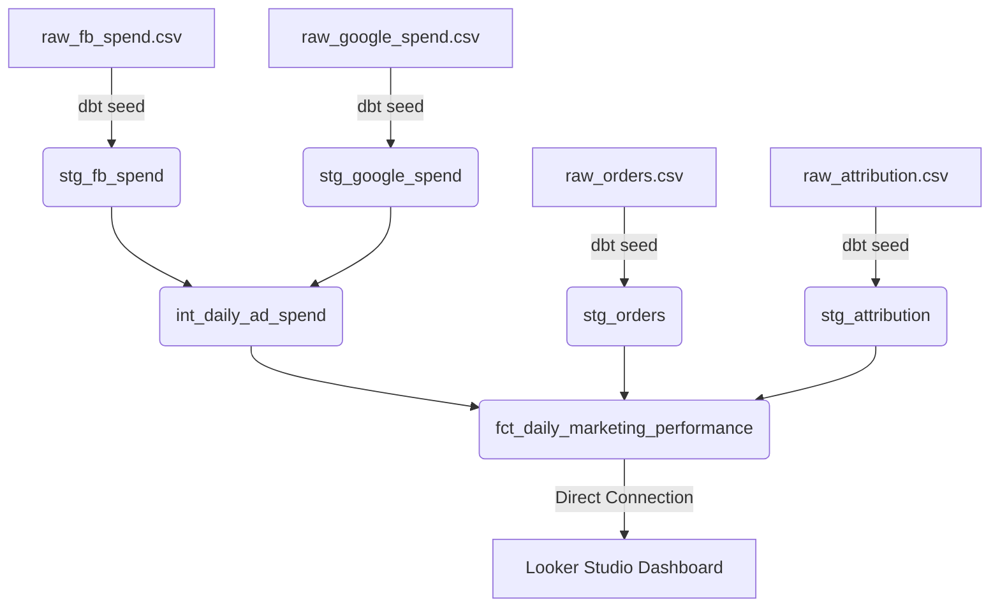

# E-Commerce Marketing Attribution & ROAS Data Pipeline

> [!NOTE]
> **Personal Side Project:** This repository is a personal side project designed to build and showcase a sample, fully functional end-to-end modern data stack pipeline. It simulates how marketing attribution and ROAS (Return on Ad Spend) calculation pipelines are architected in production environments.

This pipeline leverages **dbt Core**, **BigQuery**, and **Looker Studio**, following the **Medallion (Staging -> Intermediate -> Marts)** model design to emphasize performance optimization, data security (PII hashing), and quality controls.

## Project Architecture & Data Flow



### 1. Staging Layer (`models/staging/`)
- Casts raw inputs into appropriate data types.
- Deduplicates raw inputs using analytical functions (`row_number()`).
- **Data Governance**: Masks customer emails using SHA256 hashing to ensure GDPR/PII compliance before storing data.

### 2. Intermediate Layer (`models/marts/intermediate/`)
- Unions ad spend data across Facebook and Google Ads channels.
- Extracts campaign optimization tokens from campaign names using string split functions.

### 3. Marts Layer (`models/marts/`)
- **fct_daily_marketing_performance**: Materialized as an **incremental** model to reduce warehouse computing costs. Calculates core metrics:
  - **ROAS (Return on Ad Spend)**
  - **CAC (Customer Acquisition Cost)**

---

## Data Governance & Testing

Data quality constraints are declared in `.yml` files, executing the following tests during CI/CD:
- `unique` and `not_null` constraints on primary keys.
- `accepted_values` validation on order statuses.
- `relationships` tests to enforce foreign key integrity between attribution mapping and orders.

---

## How to Run & Verify

1. Install dependencies:
   ```bash
   dbt deps
   ```
2. Build seeds (load raw CSV mock data):
   ```bash
   dbt seed
   ```
3. Run the models:
   ```bash
   dbt run
   ```
4. Run tests:
   ```bash
   dbt test
   ```
